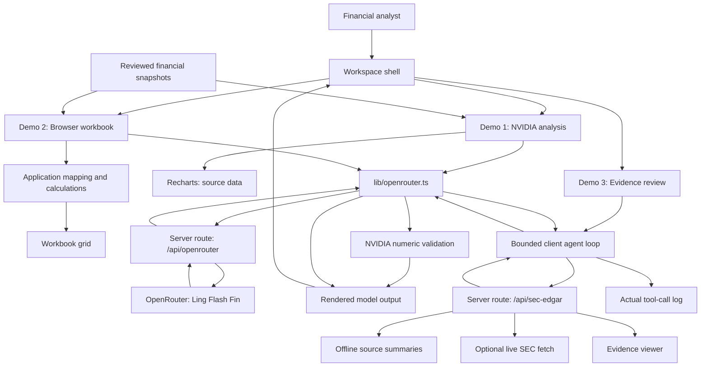

# Testing Ling-3.0-flash-Fin on Financial Data

*Building a custom Next.js terminal to test financial reasoning, workbook calculations, and source review*

[Image placeholder: application overview]

*Sample finance app built around the Ling-3.0-flash-Fin API. Image by Jim Clyde Monge.*

LLMs today are incredible for writing articles or generating code. But one area where I don't see them get used often is finance. It's just way too risky, I guess. A single hallucinated cell reference can cascade through an entire valuation sheet and destroy your discounted cash flow analysis.

Financial workflows leave little room for that kind of error. Misreading an accounting disclosure or using the wrong revenue denominator can change the conclusion even when the output looks convincing.

I wanted to see how a specialized model would handle these constraints. Instead of just running a few prompts in a chat window, I built a custom Next.js web application to test Ling 3.0 Flash Fin with sourced financial data, a small browser workbook, and tools for reviewing financial disclosures.

This article is a breakdown of what the model actually is, how I wired up the application, and the results from three demonstration workflows.

Before I get into the details, here's a demo of how each module works using the Ling 3 Flash Fin API:

[Video placeholder: walkthrough of all three modules]

## What Is Ling 3 Flash Fin?

Ling 3.0 Flash Fin is a finance-focused model built through continued training of Ling-3.0-flash on financial data. Its stated use cases include financial research, reasoning across documents, valuation, and spreadsheet workflows. The official model card describes 124 billion total parameters with 5.1 billion activated parameters. [Source: official model card](https://huggingface.co/inclusionAI/Ling-3.0-flash-Fin)

That made it an interesting candidate for this experiment. I wanted to see whether it could interpret financial categories, explain workbook updates, and recognize when a disclosure didn't contain enough information to support a calculation.

I accessed it through **OpenRouter**, using the model identifier `inclusionai/ling-3.0-flash-fin:free`. That's the model used throughout the application. [Source: OpenRouter model page](https://openrouter.ai/inclusionai/ling-3.0-flash-fin:free)

[Image placeholder: OpenRouter model page]

*Ling-3.0-flash-Fin on OpenRouter. Image by Jim Clyde Monge.*

If you prefer local inference, the official checkpoint is available on Hugging Face, and there are community GGUF quantizations, including [bartowski's Ling-3.0-flash-Fin-GGUF](https://huggingface.co/bartowski/Ling-3.0-flash-Fin-GGUF). Running those requires suitable hardware and a compatible runtime. I didn't test local inference in this project, and the OpenRouter version sends requests to an external provider.

## Let's Talk About the API Access

Financial applications need to handle network errors and slow responses clearly. A request that times out shouldn't leave a result panel looking as though an analysis succeeded.

I centralized the browser's model requests in `lib/openrouter.ts`. Every request goes through the Next.js route at `/api/openrouter`, which attaches the authorization and attribution headers before contacting OpenRouter.

The key stays **server-side** in `.env.local`:

```dotenv
OPENROUTER_API_KEY=your_openrouter_key
```

The browser calls the internal API route, keeping the OpenRouter key on the server.

Here is the core request setup, excerpted from the server route. The surrounding code validates the incoming request, checks whether the key is configured, and returns upstream errors to the browser:

```typescript
// app/api/openrouter/route.ts — request setup excerpt
const apiKey = process.env.OPENROUTER_API_KEY;

const payload: Record<string, unknown> = {
  model: LING_MODEL_ID,
  messages,
  max_tokens: 16000,
  temperature: 0.2,
};

if (tools && Array.isArray(tools) && tools.length > 0) {
  payload.tools = tools;
  if (tool_choice) {
    payload.tool_choice = tool_choice;
  }
}

const openRouterResponse = await fetch(
  "https://openrouter.ai/api/v1/chat/completions",
  {
    method: "POST",
    headers: {
      Authorization: `Bearer ${apiKey}`,
      "Content-Type": "application/json",
      "HTTP-Referer": req.headers.get("origin") || "http://localhost:3000",
      "X-Title": "Ling 3 Flash Fin Demo",
    },
    body: JSON.stringify(payload),
    signal: AbortSignal.timeout(110000),
  },
);
```

The server request has a 110-second timeout, while the browser request has a 120-second timeout. Empty responses and completions cut short by the token limit produce errors rather than accepted analyses.

This gives the terminal a clear error state if a request takes too long or returns an incomplete response.

## How I Built a Web App With the API

I wanted this to feel like a real desktop financial terminal. I used Next.js 15 with the App Router alongside Tailwind CSS for styling and Recharts for the data visualizations.

Here's the end-to-end system architecture in case any devs out there are interested:



The chart displays the supplied financial data, and the workbook runs its calculations in application code. Ling analyzes those inputs and requests supporting evidence through the research tools.

One of the most annoying parts of building AI user interfaces is handling unconstrained container growth. You send a prompt, and the model returns two thousand words of dense Markdown. The default web container stretches vertically and ruins your layout.

To fix this, I built a custom Markdown viewer component. Its rendering wrapper looks like this:

```tsx
// components/MarkdownViewer.tsx — rendering excerpt
return (
  <div
    className={cn(
      "custom-scrollbar overflow-y-auto pr-2 text-xs leading-relaxed text-slate-200 font-sans select-text space-y-1",
      maxHeight,
      className
    )}
  >
    {elements}
  </div>
);
```

I paired this with a custom scrollbar design in my global CSS. The application constrains its height and lets long responses scroll internally. The workspace stays contained and feels like a native app.

With the architecture in place, I ran the model through three distinct workflows to see where it would break.

## Demo 1: Finance Report and Visualization

First up was financial report and disclosure analysis. Equity research footnotes contain multibillion-dollar nuances that can change how you interpret a company's revenue.

I tested the model on NVIDIA, comparing Hyperscale with ACIE, which stands for **AI Clouds, Industrial, and Enterprise**.

The app uses a manually transcribed snapshot from NVIDIA's Q2 FY2027 filing, reviewed on September 10, 2026. The chart and the model receive the same underlying figures. There's no live web search in this module. [Source: NVIDIA Q2 FY2027 Form 10-Q, MD&A revenue-by-market-platform table](https://www.sec.gov/Archives/edgar/data/1045810/000104581026000075/nvda-20260726.htm)

> **Query:** Analyze NVIDIA growth drivers. Calculate Hyperscale and ACIE year-over-year growth and shares of Data Center revenue. Explain the recast and distinguish observed revenue growth from hypotheses about demand. What does this evidence not tell us about margins or end-customer concentration?

[Image placeholder: NVIDIA analysis and chart]

*Demo 1: Finance Report and Visualization. Image by Jim Clyde Monge.*

There is an important reporting detail here. NVIDIA reclassified a customer from ACIE to Hyperscale in Q2 FY2027 and recast prior periods. The original Q1 near-parity figures of roughly $37.9 billion and $37.4 billion therefore shouldn't be mixed with the newer Q2 series. The app uses the Q2 filing's consistent recast comparison.

Here are the checked calculations from the test:

| Period | Data Center ($M) | Hyperscale Share | ACIE Share |
|---|---:|---:|---:|
| FY26 Q2, recast | 41,096 | 58.81% | 41.19% |
| FY27 Q1, recast | 75,246 | 57.21% | 42.79% |
| FY27 Q2 | 89,023 | 54.72% | 45.28% |

Hyperscale revenue grew 101.55% year over year, while ACIE grew 138.14%. Data Center revenue increased 116.62%, so it more than doubled.

Those percentages use Hyperscale plus ACIE as the Data Center denominator. Edge revenue sits outside that subtotal and is included in total company revenue.

I requested structured calculations through a `submit_analysis` function schema so the application could check the numbers before displaying them.

The app checks the returned periods, subtotals, shares, and growth rates against its own calculations. Incorrect or incomplete fields trigger a visible validation error. This function is an output format for the analysis, not an external research tool.

The interface displays checked calculations separately from the model's interpretation, which still requires review.

The supplied snapshot supports comparisons of revenue and category mix. It doesn't establish category margins, individual customer concentration, or why demand changed. Those questions require additional evidence, even though the full filing contains information beyond the small table passed to Ling.

The right pane presents Hyperscale in green and ACIE in cyan using interactive Recharts bar charts. This lets me compare Ling's explanation with the financial data alongside it.

## Demo 2: Financial Modeling in a Browser Workbook

The second test combined **application calculations** with a model-generated workbook review.

I loaded an Alphabet 2026 Q2 revenue workbook into the application. It has three browser views: Summary, Q2 Actuals, and Projections. It contains seven revenue and hedging rows, with the calculations running directly in the browser.

[Image placeholder: Alphabet Summary view]

*Demo 2: Alphabet browser workbook. Image by Jim Clyde Monge.*

The historical figures come from Alphabet's 2025 annual revenue table, and the quarterly figures come from its Q2 2026 earnings release. FY2024 revenue totals $350,018 million, FY2025 totals $402,836 million, and Q2 2026 totals $119,796 million. The quarterly release is unaudited. [Annual source](https://www.sec.gov/Archives/edgar/data/1652044/000165204426000018/R44.htm), [quarterly source](https://www.sec.gov/Archives/edgar/data/1652044/000165204426000066/googexhibit991q22026.htm)

The rows include Google Search & other, YouTube ads, Google Network, subscriptions/platforms/devices, Google Cloud, Other Bets, and hedging gains or losses. Including hedging is necessary to reconcile these categories to consolidated revenue.

Alphabet reports segment results as Google Services, Google Cloud, and Other Bets. Search, YouTube, Network, and subscriptions are components of Google Services. Summing the seven non-overlapping workbook rows doesn't double-count revenue.

Clicking **Execute Update & Review** maps seven actual values into Summary. Application code recalculates the Summary total, seven Q3 scenario values, and the scenario total. Ling then receives the workbook data and explains the mapping and variances. If the model request fails, the app reports that separately from the completed workbook update.

[Image placeholder: mapped actuals highlighted in green]

*Mapped actuals and recalculated totals. Image by Jim Clyde Monge.*

With the illustrative growth assumption set to 10%, the formulas are:

```text
Q2 estimate = round(Q2 2025 actual × 1.10)
Variance = Q2 2026 actual − Q2 estimate
Q3 scenario = round(mapped Q2 2026 actual × 1.10)
Total = sum of all seven rows
```

The estimates totaled $106,070 million, producing a positive variance of $13,726 million against Q2 actual revenue. The rounded Q3 scenario values totaled $131,776 million.

Google Cloud had the largest positive variance at $9,782 million. Google Network and Other Bets had negative variances of $786 million and $28 million respectively. These are differences against an illustrative assumption, not surprises against analyst consensus.

The Q3 scenario applies the assumption quarter over quarter. It is a way to explore a possible outcome, rather than company guidance or an analyst forecast.

Corporate financial models are networks of connected calculations. This small workbook demonstrates three of the operations involved:

1. **Actuals mapping:** Move sourced quarterly values into the active-period view.
2. **Estimate replacement:** Change the active values from an illustrative estimate to the corresponding actuals.
3. **Dependency recalculation:** Update totals and scenario values that depend on those inputs.

I was pretty satisfied with how this worked. The application handled the mappings and recalculations, while Ling supplied a review of the workbook and the assumptions behind it.

## Demo 3: Financial Evidence Review

The final test was a tool-assisted financial research task using **Spire Inc.**, the natural gas company listed on the NYSE as SR, with CIK 0001126956.

Spire classified its Marketing and Storage businesses as discontinued operations. I wanted to see whether Ling could identify those businesses from the supplied disclosures and explain what information was needed to rebuild historical continuing-operations earnings. [Source: Spire Inc. Form 8-K, Item 7.01](https://www.sec.gov/Archives/edgar/data/1126956/000119312526298586/sr-20260708.htm)

[Image placeholder: Spire evidence-review workspace]

*Demo 3: Financial Evidence Review. Image by Jim Clyde Monge.*

Notice the three-column technical implementation:

1. **Tool-call terminal:** Records model-requested `read_filing` calls, their source IDs, and completion or failure status. The count reflects the calls executed during the run.
2. **Evidence viewer:** Shows the text returned by each successful call, a source link, and whether the result is an offline summary or a live excerpt.
3. **Model findings:** Displays Ling's analysis, its explanation of the accounting treatment, and any missing evidence needed for a calculation.

The browser orchestrates a bounded agent loop. It forwards model requests through the server proxy, dispatches requested source reads to `/api/sec-edgar`, and returns their results as tool messages. The loop allows up to six model turns and 12 source-tool calls before reporting an incomplete run.

For this sample, I selected the default offline mode. Ling requested both available sources, and the log recorded **two completed calls**. Each call returned a curated source summary for the model to read.

The summaries cover the July recast disclosure and relevant portions of Spire's June 30, 2026 Form 10-Q. They establish the discontinued-operation classification but omit the numerical income and disposal-group tables. [Quarterly source](https://www.sec.gov/Archives/edgar/data/1126956/000119312526334335/sr-20260630.htm)

Here's the task I gave the model:

> **Query:** For Spire Inc. (NYSE: SR), establish which businesses are discontinued and explain how to rebuild FY2025 continuing-operations earnings on the recast basis. Read both available sources. Calculate historical profit only if the source tables contain all required amounts, identify the exact period and units, and show the arithmetic. Otherwise identify the missing evidence.

Ling identified Storage and Marketing as discontinued operations. It also stated that the summaries lacked the figures needed to calculate historical profit.

A valid reconciliation would need the consolidated net income and discontinued-operations income for the same entity, period, and after-tax basis. Continuing-operations net income is different from EBIT or an adjusted non-GAAP measure. Sale proceeds alone can't fill those gaps.

The application also has an optional live SEC mode. It requires a `SEC_USER_AGENT` value identifying the organization and contact email. The server fetches only the allowlisted filings and extracts bounded HTML text excerpts. It doesn't parse XBRL or read numbers embedded in slide images.

For the run shown here, I used offline summaries because live SEC requests from my environment returned HTTP 403. The result demonstrates source review and identification of missing evidence; calculating historical profit would require the numerical schedules as well.

That was a useful result in itself. In financial research, recognizing that a source doesn't contain enough information is part of getting the answer right.

I have open-sourced the project. You can get the code from the GitHub repo below.

[GitHub: jimclydegm/LingFinance](https://github.com/jimclydegm/LingFinance)

## Why Should You Care?

If you build fintech applications or work in equity research, you already know the pain of using LLMs for math-heavy tasks.

A convincing explanation isn't enough. Revenue needs to reconcile, spreadsheet assumptions need to be explicit, and accounting conclusions need to trace back to the right disclosures.

Ling 3 Flash Fin produced useful financial explanations and requested the source tools provided to it. The application made those results easier to inspect by placing the evidence, calculations, and commentary together.

That makes this approach worth testing for the repetitive parts of financial research. The calculations still need independent checks, and the interpretations still need review.

## Final Thoughts

Alright, I hope you found this demo interesting and also learned how the Ling 3 Flash Fin API works.

Building this Next.js terminal gave me a practical way to explore a domain-specific model. I could inspect the financial inputs, see which tools it requested, and compare its calculations with values generated by the application.

In the examples above, Ling analyzed NVIDIA's revenue mix, reviewed an Alphabet revenue workbook, and identified the evidence needed for a continuing-operations earnings calculation. Those are useful starting points if you are building an automated financial research tool.

What do you think of Ling 3 Flash Fin's API? Do you think this would be helpful in the finance industry? Let me know what you think.
